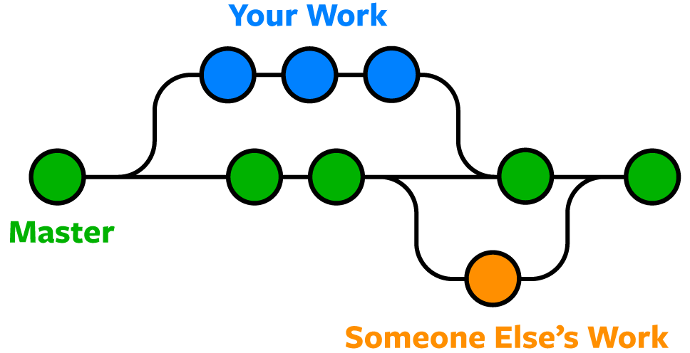
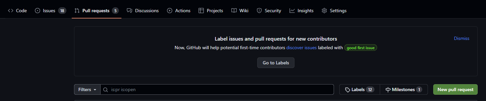
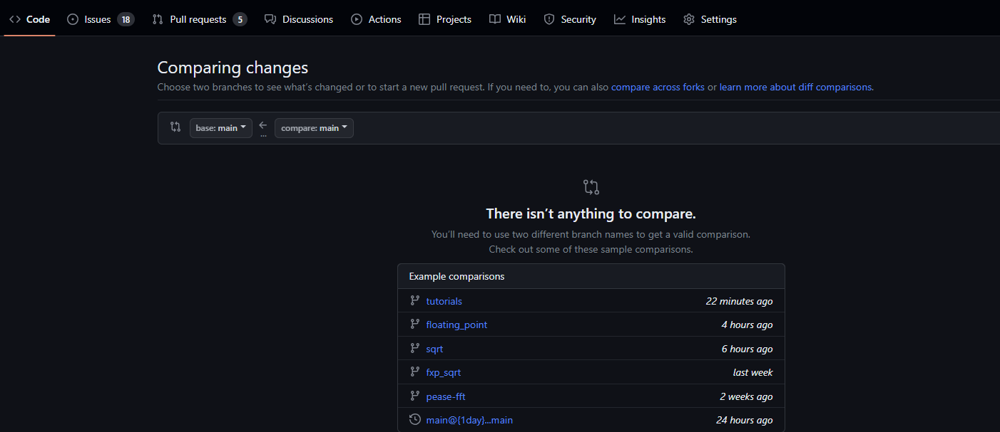
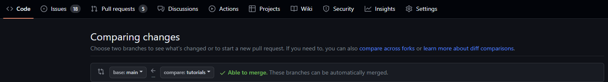
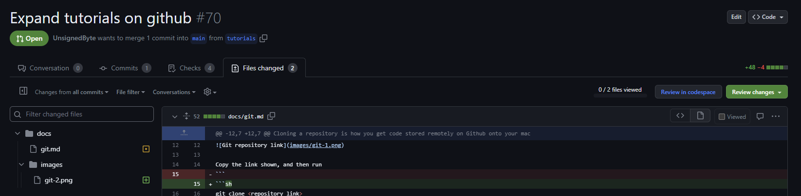
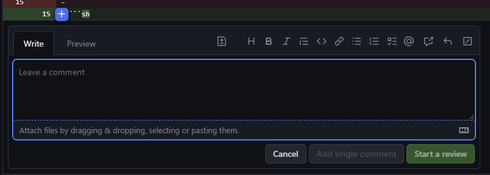
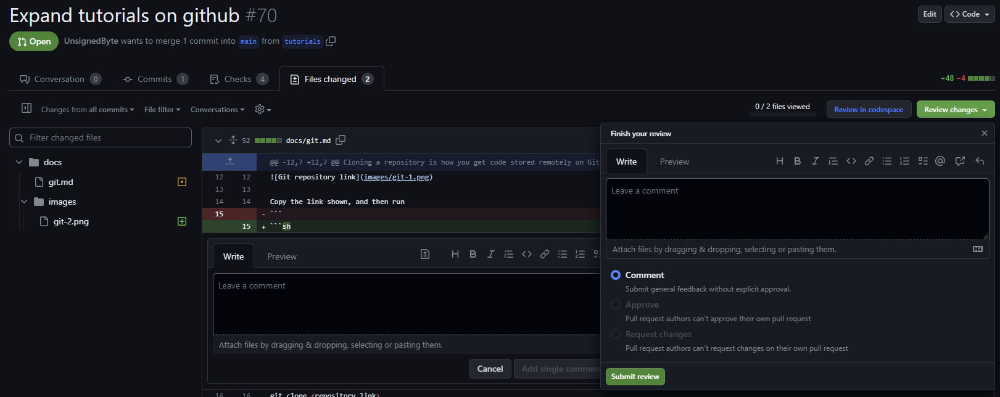

# `Git`/`Github` Quickstart

For a more comprehensive tutorial, check out the [Confluence Git/Github Primer](https://confluence.cornell.edu/pages/viewpage.action?pageId=476108648).

## Cloning repositories

If you haven't yet, you'll want to set up github with the ecelinux machine, which you can do by following [this tutorial](https://confluence.cornell.edu/pages/viewpage.action?spaceKey=c2s2&title=Configuring+GitHub+for+our+server).


Cloning a repository is how you get code stored remotely on Github onto your machine. To do so, you'll need the link to your github repository. Go to the repository, click the `<> Code` button, and select `SSH` from the three options under `Clone`.


Copy the link shown, and then run
```sh
git clone <repository_link>
```
replacing `<repository_link>` with the link to your repository.

This will create a new folder with the name of your repository, and clone all the remote code into it. In our case, this will create the `c2s2_ip` folder.

## Commits

Commits are a way to version code. Each commit stores the changes it made from its last commit, which allows us to save the history of each file in our github repository. You can think of this as your edit history, and each `commit` as a save in that edit history.

### Staging

Before we make a commit, we run
```sh
git add .
```
to **stage** all our files. Staging a file means we are ready to commit a file, and lets us commit certain files without committing incomplete ones.
* In order to stage specific files, do `git add path/to/file.txt`
* Wildcards like `git add *.txt` or `git add path/*` are also supported.

### Committing
Running
```sh
git commit -m "name of commit"
git push
```
will create a commit with all your changes, and then pushes it to github. This takes all your staged changes and "saves" them in the edit history.

In general, *name your commits with a short description of their changes*. Each commit should contain approximately one logical addition/modification, and for good practice we recommend **committing frequently** so that changes can be undone easily.

Here are a couple examples of when to commit:
1. Just finished the first prototype of a block but haven't tested it yet.
2. Added a couple passing (or failing) tests to a block.
3. Formatted some code to make it look nicer.
4. Documented some code.

Try to avoid doing many of these steps at once and then committing them all together.

### Pushing and Pulling
In order to sync up your local changes to the remote repository, you need to run
```sh
git push
```
to "push" your local changes to the remote repository (this means you are uploading your local changes), and
```sh
git pull
```
to "pull" new updates from the remote repository to update your local version.

## Branches

All of our work is done on github **branches**.

### What is a Branch?



If we treat our code history as a line of commits, a branch allows you to "branch" off the main commit history and make changes without being affected by updates to the main branch. This is very useful when multiple people are working on the same repository, as another member's changes cannot affect your own work until you decide to merge your edits back to the main branch.

### Listing Branches
Running
```sh
git branch
```
lists all your local branches, while
```sh
git branch -a
```
lists all branches including remote branches (branches on the github repository). These will usually be prefixed by `origin/branch_name`.

### Switching between branches
Running
```sh
git checkout <branch_name>
```
allows you to switch to a specified branch. If a branch `origin/branch` exists on the remote repository, `git checkout branch` will make a local version of the branch and automatically copy the remote version.

### Creating a branch
You can create a branch using
```sh
git branch <branch_name>
```
and switch to it with `git switch`.

*NOTE: Often times you will want to run `git checkout main` and `git pull` before creating a branch to make sure your work branches off from the main branch and is updated.*

Then, the next time you run `git push` you will instead need to run
```sh
git push -u origin <branch_name>
```
in order to hook up a remote branch to track your local branch changes.
### Merging Branches
Merging branches is how you merge the changes from one branch into another locally. This will most often be used to merge the changes from the main branch into your current branch to add new changes into your branch.

Running
```sh
git merge main
```
while in your branch will merge the changes from `main` into your branch (similarly, `git merge branch` will merge the changes from `branch` into your branch).

Occasionally, if someone else has edited the same part of a file that you have before you try to merge changes, there will be a merge conflict. Github will tell you which files have conflicts and you will be able to choose how to resolve them to make sure both members' changes are not lost.

## Pull Requests
Pull Requests are a nice way to track changes to your local branch and are the only way members are allowed to merge code into the main branch. When you `git push` your changes from your local branch, we recommend always also creating a pull request from Github.To do so, navigate to the `Pull Requests` tab in the repository and click `New Pull Request`.

Next, you will see a page that looks as follows:

Click the `compare: main` dropdown and select the branch you want to compare.

Finally, click `Create Pull Request` and type in a title that describes what features/changes you are implementing, and a quick description with some details on the specifics.

### Merging Pull Requests
Before a pull request can be merged, we require that some automatic tests pass and that your code has been reviewed. Tests are run automatically on every push and check code formatting and also run `pytest`. Your code can be reviewed by another member, and just ensures that the code is readable and has been looked over before it is merged to main.

### Reviewing Pull Requests
In order to review a pull request, go to the `Files Changed` tab in the pull request. This will show added (green) and removed (red) lines in each file changed by the pull request.


Leave comments on a pull request by clicking the `+` symbol at a line, and then typing in a comment and selecting `Start a review` or  `Add single comment`.


We recommend leaving comments whenever you are confused by some changes or have a critique. Here are some examples:
* Code is confusingly documented or not documented.
* You think there is a bug in an implementation.
* You have questions about some code.
* Anything that makes you feel a need to leave a comment!

When you are done leaving comments, go to the top of the page and select `Review Changes` in the top right. Leave a comment with a summary of your review and select `Approve` or `Request Changes` depending on if you want the author to change something!
